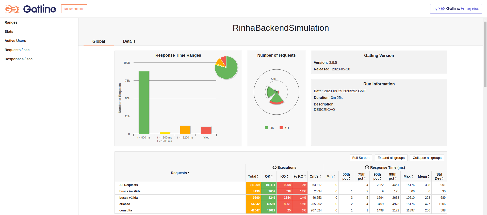
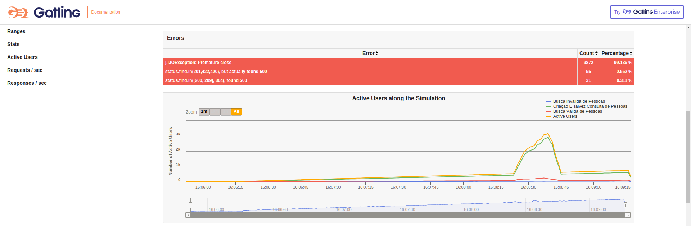
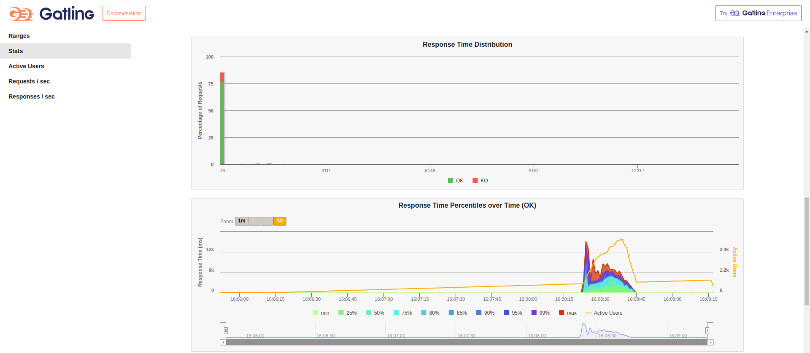
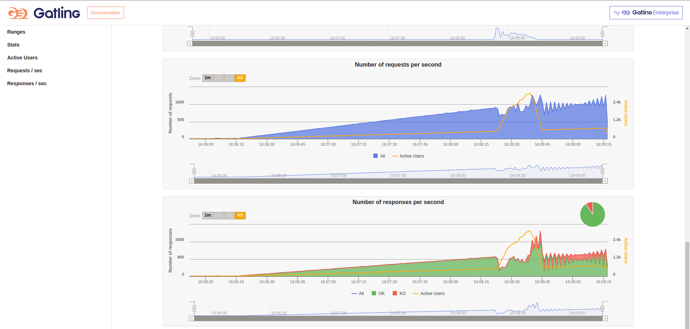
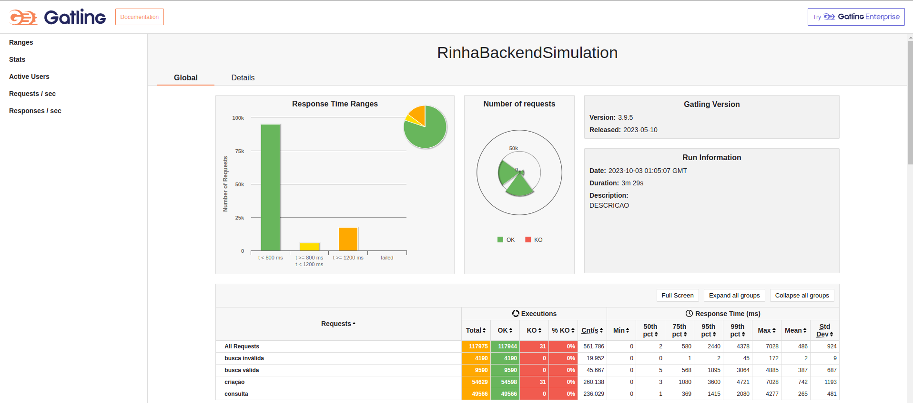
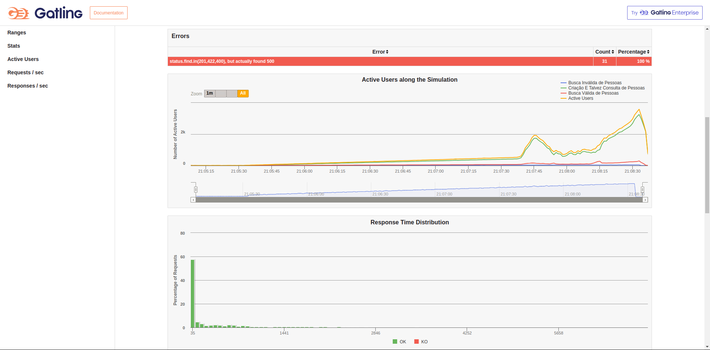
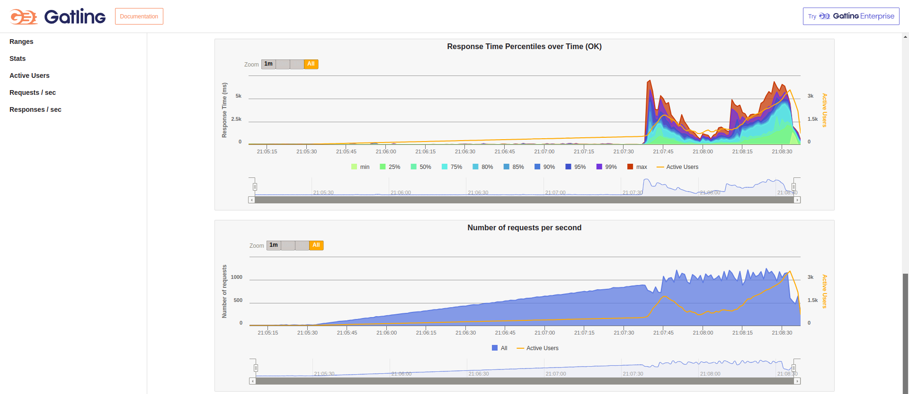
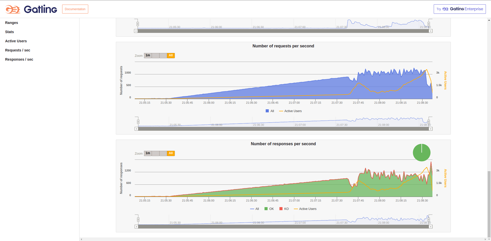

# Rinha BE 2023 - Q3 @HalexViotto/@HalexV - Versão usando PG Driver

### Tecnologias usadas:

- Node
- Nest
- Fastify
- ~~Prisma~~
- PG Driver (driver do postgres para node)
- PostgreSQL

Algumas configurações foram baseadas neste repositório https://github.com/lukas8219/rinha-be-2023-q3

### Fase de otimização

- Consegui um resultado satisfatório.
- Segue abaixo as imagens do resultado do gatling.

---

#### Update 1

- Aplicando as mudanças que o @akitaonrails enviou para o [repositório](https://github.com/lukas8219/rinha-be-2023-q3/pull/2/files) do @lukas8219, consegui obter melhores resultados. Segue abaixo as imagens:

### Objetivo

Tentar extrair o máximo de performance baseado na rinha de backend 2023 utilizando as ~~firulas~~ técnicas recomendadas para desenvolvimento de software, tais como:

- DDD
- SOLID
- Frameworks
- ~~ORM~~
- Typescript
- ESlint
- Prettier
- Vitest
- Unit Tests
- End-to-end Tests
- Etc.

### Script

Instalar o projeto:

- npm ci

Rodar local:
É necessário subir o container do banco:

- docker compose -f docker-compose-test-e2e.yml
- npm run start:dev para iniciar a aplicação de forma local

Rodar testes unitários:

- npm run test ou test:watch

Rodar os testes E2E:

- npm run test:e2e
  ~~!AVISO! A suíte e2e está dando erros por conta do prisma e não sei como resolver isso ainda.~~
  Resolvido. Configurei a suíte de testes E2E para rodar de forma sequêncial.

Rodar os containers para o teste:

- npm run build
- docker compose up

Quaisquer alterações no código do projeto precisam ser buildadas com npm run build novamente e apagar as imagens criadas pelo comando de `compose up` com `docker image rm` e os nomes das imagens criadas. A última parte serve para que as imagens sejam geradas do zero novamente contendo as alterações realizadas.

!AVISO!

- O prisma atualmente não oferece funcionalidades para criar colunas computadas no banco de dados através do prisma schema.
- Uma forma de resolver isso é editar a migration que é gerada e adicionar os comandos para gerar esse tipo de coluna.
- Atualmente, no momento de usar o npx prisma migrate dev, o prisma fica gerando uma nova migration para dropar essa coluna computada do banco e remover e adicionar de novo o índice criado para o searchable.
- Não sei porque isso está ocorrendo.

Alguns lugares que eu consultei:

- https://github.com/nikolasburk/generated-columns
- https://github.com/prisma/prisma/issues/6336
- https://github.com/prisma/prisma/issues/3394
- https://www.prisma.io/docs/concepts/components/prisma-schema/postgresql-extensions

É, os caras tem issue sobre esses problemas abertos há mais de dois anos.
