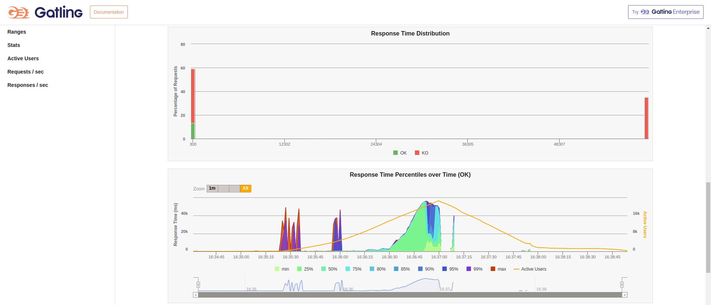

# Rinha BE 2023 - Q3 @HalexViotto/@HalexV - Prisma Version

### Tecnologias usadas:

- Node
- Nest
- Fastify
- Prisma
- PostgreSQL

Algumas configurações foram baseadas neste repositório https://github.com/lukas8219/rinha-be-2023-q3

### Fase de otimização

- Utilizando as mesmas configurações de docker compose da versão do [PG Driver](https://github.com/HalexV/rinha-de-backend-2023-q3/tree/replace-prisma-with-pg-driver) os resultados utilizando o Prisma foram bem inferiores.

- O principal problema que identifiquei com o Prisma foi ele não utilizar novas conexões na pool até atingir o limite configurado, na fase em que a quantidade de requests é massiva. Não sei por que ele se comporta assim, desta forma utilizando poucas conexões com o banco de dados postgres, começam a ocorrer timeouts de queries tentando pegar uma nova conexão no pool de conexões.

- Para tentar identificar o problema, acabei utilizando o pgHero para verificar a quantidade de conexões abertas com o postgres e implementei uma rota para pegar as métricas do prisma (`/prisma/metrics``). Logo abaixo está uma métrica do prisma que eu peguei no momento do teste em que a quantidade de requests estava massiva. Perceba que existe um campo indicando a quantidade de queries esperando uma conexão, a quantidade de conexões abertas e a quantidade de conexões ociosas. Veja que existem muitas queries querendo uma conexão e um monte de conexões ociosas, que de alguma forma, não são distribuídas.

```json
{
  "counters": [
    {
      "key": "prisma_client_queries_total",
      "labels": {
        "appId": "81"
      },
      "value": 11868,
      "description": "Total number of Prisma Client queries executed"
    },
    {
      "key": "prisma_datasource_queries_total",
      "labels": {
        "appId": "81"
      },
      "value": 11881,
      "description": "Total number of Datasource Queries executed"
    },
    {
      "key": "prisma_pool_connections_open",
      "labels": {
        "appId": "81"
      },
      "value": 4,
      "description": "Number of currently open Pool Connections"
    }
  ],
  "gauges": [
    {
      "key": "prisma_client_queries_active",
      "labels": {
        "appId": "81"
      },
      "value": 0,
      "description": "Number of currently active Prisma Client queries"
    },
    {
      "key": "prisma_client_queries_wait",
      "labels": {
        "appId": "81"
      },
      "value": 3834,
      "description": "Number of queries currently waiting for a connection"
    },
    {
      "key": "prisma_pool_connections_busy",
      "labels": {
        "appId": "81"
      },
      "value": 2,
      "description": "Number of currently busy Pool Connections (executing a database query)"
    },
    {
      "key": "prisma_pool_connections_idle",
      "labels": {
        "appId": "81"
      },
      "value": 238,
      "description": "Number of currently unused Pool Connections (waiting for the next pool query to run)"
    },
    {
      "key": "prisma_pool_connections_opened_total",
      "labels": {
        "appId": "81"
      },
      "value": 4,
      "description": "Total number of Pool Connections opened"
    }
  ],
  "histograms": [
    {
      "key": "prisma_client_queries_duration_histogram_ms",
      "labels": {
        "appId": "81"
      },
      "value": {
        "buckets": [
          [0, 0],
          [1, 11599],
          [5, 192],
          [10, 1],
          [50, 29],
          [100, 2],
          [500, 13],
          [1000, 8],
          [5000, 19],
          [50000, 3]
        ],
        "sum": 78713.88014399995,
        "count": 11866
      },
      "description": "Histogram of the duration of all executed Prisma Client queries in ms"
    },
    {
      "key": "prisma_client_queries_wait_histogram_ms",
      "labels": {
        "appId": "81"
      },
      "value": {
        "buckets": [
          [0, 0],
          [1, 12066],
          [5, 1],
          [10, 0],
          [50, 2],
          [100, 1],
          [500, 17],
          [1000, 16],
          [5000, 134],
          [50000, 225]
        ],
        "sum": 2227960.9118840015,
        "count": 12462
      },
      "description": "Histogram of the wait time of all queries in ms"
    },
    {
      "key": "prisma_datasource_queries_duration_histogram_ms",
      "labels": {
        "appId": "81"
      },
      "value": {
        "buckets": [
          [0, 0],
          [1, 11756],
          [5, 45],
          [10, 18],
          [50, 13],
          [100, 2],
          [500, 13],
          [1000, 8],
          [5000, 22],
          [50000, 4]
        ],
        "sum": 94105.177003,
        "count": 11881
      },
      "description": "Histogram of the duration of all executed Datasource Queries in ms"
    }
  ]
}
```

- Portando, o resultado abaixo possui uma performance ruim porque o Prisma buga com o pool de conexões no momento de alta carga.

- Seguem abaixo as imagens do teste Gatling.
  
  
  
  

### Objetivo

Tentar extrair o máximo de performance baseado na rinha de backend 2023 utilizando as ~~firulas~~ técnicas recomendadas para desenvolvimento de software, tais como:

- DDD
- SOLID
- Frameworks
- ORM
- Typescript
- ESlint
- Prettier
- Vitest
- Unit Tests
- End-to-end Tests
- Etc.

### Script

Instalar o projeto:

- npm ci

Rodar local:

É necessário subir o container do banco:

- docker compose -f docker-compose-test-e2e.yml
- npx prisma migrate deploy, para aplicar as migrations
- npm run start:dev para iniciar a aplicação de forma local

Rodar testes unitários:

- npm run test ou test:watch

Rodar os testes E2E:

- npm run test:e2e

  ~~!AVISO! A suíte e2e está dando erros por conta do prisma e não sei como resolver isso ainda.~~
  Resolvido. Configurei a suíte de testes E2E para rodar de forma sequêncial.

Rodar os containers para o teste:

- npm run build
- docker compose up

Quaisquer alterações no código do projeto precisam ser buildadas com npm run build novamente e apagar as imagens criadas pelo comando de `compose up` com `docker image rm` e os nomes das imagens criadas. A última parte serve para que as imagens sejam geradas do zero novamente contendo as alterações realizadas.

!AVISO!

- O prisma atualmente não oferece funcionalidades para criar colunas computadas no banco de dados através do prisma schema.
- Uma forma de resolver isso é editar a migration que é gerada e adicionar os comandos para gerar esse tipo de coluna.
- Atualmente, no momento de usar o npx prisma migrate dev, o prisma fica gerando uma nova migration para dropar essa coluna computada do banco e remover e adicionar de novo o índice criado para o searchable.
- Não sei porque isso está ocorrendo.

Alguns lugares que eu consultei:

- https://github.com/nikolasburk/generated-columns
- https://github.com/prisma/prisma/issues/6336
- https://github.com/prisma/prisma/issues/3394
- https://www.prisma.io/docs/concepts/components/prisma-schema/postgresql-extensions

É, os caras tem issue sobre esses problemas abertos há mais de dois anos.
